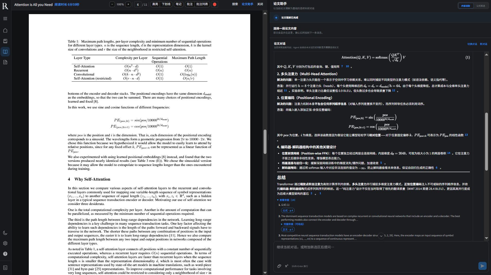
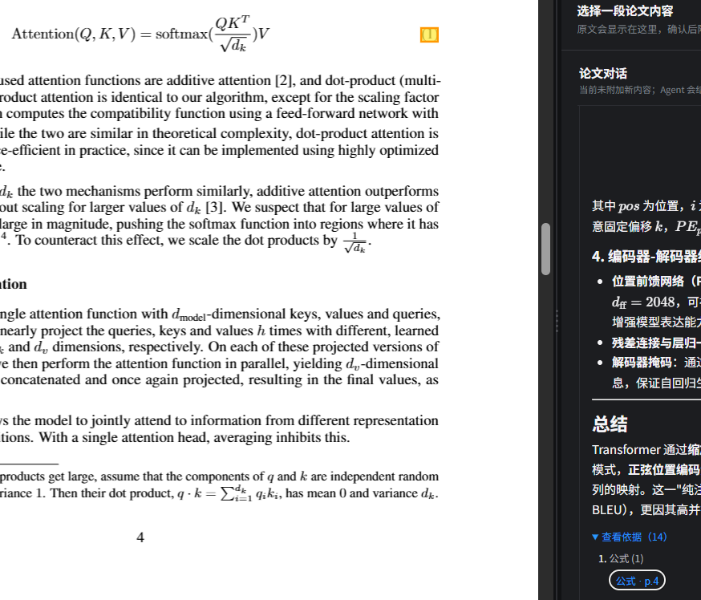
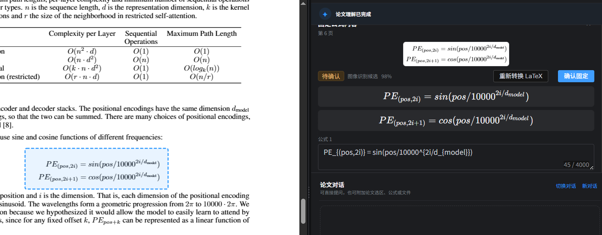
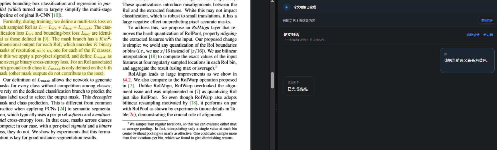
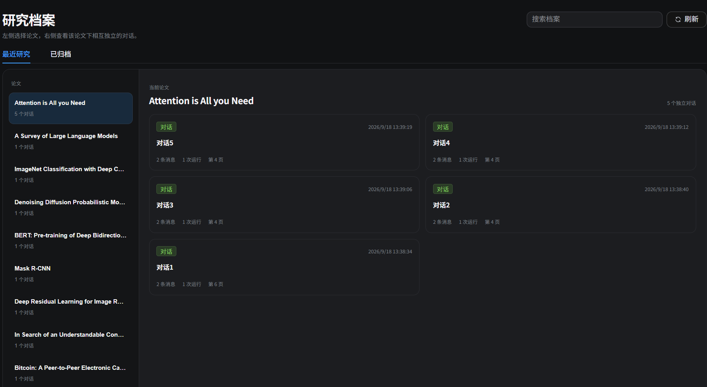

# ResearchAssistant

[English](README.en.md) | **简体中文**

**ResearchAssistant** 是一个面向科研论文阅读场景的 AI 助手，旨在减少论文原文、对话与笔记之间的频繁切换，并提升 AI 回答的可追溯性与跨会话连续性。

系统基于论文解析结果构建可持久化的论文理解与版本化来源索引，并结合 LangChain4j Tool Calling，使 Agent 能够按需获取论文概览、定位原文证据并执行页面操作。通过双栏 PDF 阅读、证据回链、分层上下文管理与多会话记忆，将论文阅读、提问、查证与标注整合到统一工作流中。

上图展示了论文阅读工作区：左侧是 PDF 阅读器，右侧是基于当前论文理解的连续对话。阅读、选区、公式、引用和页面操作不需要在多个工具之间切换。

## 核心亮点

- **版本化论文事实层**：使用 PDF SHA-256、PDFBox 版面制品和 `SourceObject / SourceLocator` 建立当前 PDF 版本的可读、可引用来源；PDF 变化后，旧来源和页面锚点不会继续用于新回答。
- **证据可追溯的研究对话**：论文画像负责全文理解和检索规划，原文来源负责事实核验；回答中的引用可以定位到 PDF 页码、公式、图表或页面区域。
- **受约束的 Agent 页面操作**：Agent 只产生页面操作意图和可信来源，服务端解析目标、签发带运行绑定和有效期的 `ActionTicket`，前端执行后提交真实回执。
- **一个 Agent 按需使用三个 Skill**：`paper-profile`、`paper-evidence` 和 `paper-action` 共享同一论文上下文，分别负责全文理解、原文取证和页面操作。
- **持久化研究运行时**：保存研究会话、`Turn / Run / ToolCall`、上下文摘要、异步任务和运行事件，支持澄清、取消、超时、客户端操作等待和状态恢复。

## 产品能力

- 管理论文库、文件夹、标签、阅读状态和 DOI / arXiv 元数据；
- 在 PDF 中搜索、缩放、选择文字、框选公式，并创建高亮、下划线、笔记和批注；
- 用户主动启动论文理解，生成论文结构、论文画像、公式/图表来源和可回链证据；
- 在同一篇论文下创建多个相互隔离的研究对话，保存阅读位置、选区、附件、消息和引用；
- 通过 Agent 追问论文概念、方法、公式和实验结论，并将明确的页面操作交给前端执行；
- 通过任务中心查看论文理解、导入和其他异步任务的进度、结果、失败、取消和重试状态。

## 系统架构

~~~mermaid
flowchart TD
    UI["Vue 3 阅读与对话工作区"] --> API["Spring Boot REST + SSE"]

    API --> PAPER["论文与阅读服务"]
    API --> AGENT["Agent 运行时"]
    API --> TASK["持久化任务管理"]

    PAPER --> PARSER["PDFBox 版面与文本解析"]
    PARSER --> SOURCES["版本化来源目录"]

    AGENT --> SKILLS["按需激活的三个 Agent Skill"]
    SKILLS --> PROFILE["paper-profile"]
    SKILLS --> EVIDENCE["paper-evidence"]
    SKILLS --> ACTION["paper-action"]
    EVIDENCE --> GROUND["引用与版本校验"]
    ACTION --> TICKET["ActionTicket 与客户端回执"]

    SOURCES --> DB["MySQL + Flyway"]
    AGENT --> DB
    TASK --> DB
    PAPER --> FILES["本地 PDF、图片与附件"]
    GROUND --> UI
    TICKET --> UI
~~~

前端只依赖 REST 接口、SSE 事件和页面操作结果。论文解析、来源索引、Agent 运行状态和异步任务都由 Spring Boot 统一编排，结构化数据由 MySQL + Flyway 持久化，本地文件系统保存 PDF、图片和对话附件。

## 核心执行流程：论文事实和页面操作都要经过可信链路

~~~mermaid
flowchart TD
    A["用户提出问题、附加选区或请求页面操作"] --> B["创建并持久化 Turn / Run"]
    B --> C["组装论文身份、历史摘要、最近对话和可信选区"]
    C --> D["LangChain4j Tool Calling"]
    D --> E{"按需激活 Skill"}

    E -->|全文理解| F["读取论文画像"]
    E -->|论文事实| G["检索并读取当前版本 SourceObject"]
    E -->|页面操作| H["解析可信来源和操作意图"]

    F --> I["形成研究方向"]
    G --> J["服务端校验版本、定位和引用范围"]
    H --> K["签发 ActionTicket"]

    I --> L["生成回答"]
    J --> L
    L --> M["引用回链到 PDF 页面"]

    K --> N["PDFium 在浏览器执行操作"]
    N --> O["提交客户端回执"]
    O --> P["校验回执并持久化批注"]
~~~

- 论文画像是压缩后的理解结果，不能替代原文证据；
- 模型不能自行编造页码、坐标或 `sourceObjectId`；
- 页面操作必须由服务端解析当前版本目标，前端真实执行并回执；
- `WAITING_USER` 表示等待用户澄清，`WAITING_CLIENT` 表示等待浏览器完成页面操作。

## Agent Skill 设计

项目使用一个共享论文上下文的 Agent，Skill 只在当前请求需要时激活，不把同一篇论文拆成三个互相转交状态的 Agent。

| Skill | 职责 | 是否直接执行页面操作 |
|---|---|---|
| `paper-profile` | 组织研究问题、整体方法、贡献、实验和局限，帮助 Agent 建立全文视角 | 否，只读理解 |
| `paper-evidence` | 查找原文、公式、图表、算法、实验数值、页码和页面定位 | 否，只读取证 |
| `paper-action` | 将明确的跳转、高亮、下划线、笔记或批注意图转换为可信页面操作 | 否，生成受控操作请求，实际执行需经过 `ActionTicket` 与客户端回执 |

画像负责“理解方向”，证据负责“事实落地”，操作 Skill 负责“页面行为”。三者共享同一会话、论文版本和引用协议。

## 关键工程设计

### 论文画像与原文证据分离

论文理解任务由用户主动启动。后端使用 PDFBox 生成带页面和版面信息的结构化论文产物，再生成可持久化的论文画像和来源目录。画像适合回答“这篇论文整体在做什么”，但公式、实验数值和最终引用必须重新读取当前 PDF 版本的 `SourceObject`。

当前证据检索基于与 PDF 版本绑定的本地来源、结构及版面信息进行确定性查找与回读，不依赖 Embedding、向量数据库或独立 RAG；论文画像用于整体理解与检索导航，不能替代最终原文证据。

### 版本、会话与上下文隔离

- 所有论文派生产物绑定 PDF `documentHash` 和解析版本；PDF 更新后旧结构、旧画像、旧来源和旧锚点不能继续服务当前回答；
- 同一篇论文可以创建多个研究会话，选区、附件、公式和消息只属于当前会话或当前轮次；
- `AgentContextAssembler` 组装系统约束、论文身份、历史摘要、最近对话、可信选区和附件；
- `AgentRunContextHarness` 对工具结果进行投影和折叠，并控制单次模型请求预算；
- 原始消息持续保存在数据库，摘要只承担长期研究状态，不宣称上下文无损。

### ActionTicket 与客户端回执

页面操作不是模型直接控制 PDF 坐标，而是经过以下边界：

1. Agent 确认用户的操作类型和目标；
2. 服务端根据当前版本的 `sourceObjectId` 和 `SourceLocator` 解析页面目标；
3. 服务端签发绑定 Run、ToolCall、论文版本、来源和有效期的 `ActionTicket`；
4. PDFium 在浏览器中执行真实页面操作，并返回实际坐标和文本锚点；
5. 服务端校验票据、版本、定位和回执后，才保存批注或完成运行。

### 持久化任务与状态恢复

一次研究请求可能经过多轮模型调用、工具调用、用户澄清和浏览器操作，因此运行状态不能只存在于一次 HTTP 请求中。项目持久化 `Turn / Run / ToolCall` 和任务状态，并通过 REST 查询、控制，通过 SSE 推送事件。

声明了 `task_type` 的可恢复异步任务会把参数、租约、尝试次数和结果写入 MySQL，服务重启后可以重新调度；进程内闭包任务在重启时会被标记为失败，不会伪装成已经恢复了中断的模型生成。

## 评测证据

评测数据位于 `backend/src/test/resources/eval/agent-skill-300.jsonl`，指标定义见 [`docs/agent-skill-metrics.md`](docs/agent-skill-metrics.md)，评测集设计见 [`docs/skill-evaluation-plan.md`](docs/skill-evaluation-plan.md)。

| 评测项 | 案例 / 数据 | 结果 |
|---|---:|---|
| `paper-profile` 路由 | 39 个必需正例 | Precision 100.00% / Recall 94.87% / F1 97.37% |
| `paper-evidence` 路由 | 220 个必需正例 | Precision 100.00% / Recall 98.18% / F1 99.08% |
| `paper-action` 路由 | 80 个必需正例 | Precision 100.00% / Recall 100.00% / F1 100.00% |
| 结果有效性 | 300 条结果记录 | 300 / 300；失败记录 0；无效请求 0 |

## 功能展示

### 证据回链与论文引用

回答中的引用可以跳转到当前 PDF 的页码和页面区域，右侧同时保留引用来源和回答上下文。

### 公式框选与 LaTeX 辅助

框选公式后，系统提供公式区域识别和可编辑的 LaTeX 辅助内容；最终依据仍然是当前 PDF 页面。

### Agent 页面操作

用户明确提出“把当前选区高亮为黄色”等请求后，Agent 负责理解意图，系统完成真实页面执行并保存结果。

### 研究档案与多会话

同一篇论文可以拥有多个相互隔离的研究对话，消息数量、运行次数和最近阅读页码都会进入研究档案。

## 技术栈

| 层次 | 技术 |
|---|---|
| 前端 | Vue 3、Vite、Element Plus、vxe-table、PDF.js、PDFium/WASM |
| 后端 | Java 17、Spring Boot 3.2.6、Maven、MyBatis-Plus |
| Agent | LangChain4j 1.15.1、OpenAI-compatible API、Gemini Native、Agent Skill |
| 数据 | MySQL 8、Flyway；测试使用 H2 |
| PDF | Apache PDFBox、PDF.js、PDFium/WASM |
| 通信 | HTTP REST、SSE |

## 数据与隐私

论文、批注、研究会话等业务数据默认保存在本机 MySQL 与本地文件系统中。配置 `RA_MASTER_KEY` 后，模型 API Key 使用 AES-GCM 加密保存。

使用第三方模型供应商时，与模型交互所需的论文内容、上下文和问题可能发送至对应服务商；请根据实际使用的模型供应商确认其数据处理政策。密码、API Key 和主密钥不应写入 Git。

默认本地数据目录如下：

~~~text
data/papers/              # 导入的论文 PDF
data/figures/             # 论文图像或派生图像
data/agent-attachments/   # Agent 对话附件
runtime/                  # 本地运行日志和进程状态
~~~

## 项目启动

### 方式 A — Windows 一键启动

环境要求：Windows 10/11 x64、JDK 17+、Node.js 18+、npm 和 MySQL 8。

在项目根目录执行：

~~~bat
scripts\start-all.cmd
~~~

脚本会依次检查并启动 MySQL、创建缺失的 `research_assistant` 数据库、通过 Flyway 初始化或升级表结构，然后启动 Spring Boot 后端和 Vite 前端。

默认访问地址：

~~~text
前端：http://127.0.0.1:5173
后端健康检查：http://127.0.0.1:8080/actuator/health
数据库：127.0.0.1:3306
~~~

停止项目脚本管理的服务：

~~~bat
scripts\stop-all.cmd
~~~

### 方式 B — Windows 源码开发

先确保 MySQL 已启动，并根据本机环境配置数据库账号：

~~~bat
set "SPRING_DATASOURCE_USERNAME=root"
set "SPRING_DATASOURCE_PASSWORD=your-local-password"
set "RA_MASTER_KEY=your-stable-local-key"
~~~

启动后端：

~~~bat
cd backend
mvnw.cmd spring-boot:run
~~~

另开终端启动前端：

~~~bat
cd frontend
npm.cmd ci
npm.cmd run dev
~~~

模型供应商、通道、Base URL、模型名和 API Key 在网页设置页配置。设置 `RA_MASTER_KEY` 后，API Key 使用 AES-GCM 加密保存；密码、API Key 和主密钥请不要写入 Git。

### 自动化测试与构建

后端测试使用独立的 H2 数据库，不读取本机开发库：

~~~bat
cd backend
mvnw.cmd clean test
~~~

前端单元测试和生产构建：

~~~bat
cd frontend
npm.cmd ci
npm.cmd run test:unit
npm.cmd run build
~~~

## 项目结构

~~~text
ResearchAssistant/
├── backend/
│   ├── src/main/java/com/research/assistant/
│   │   ├── controller/              REST、SSE 和页面操作接口
│   │   ├── service/agent/           Agent、Skill、证据和 ActionTicket
│   │   ├── service/pdf/             PDFBox 版面解析和来源索引
│   │   ├── service/async/           持久化异步任务、重试和恢复
│   │   └── service/memory/          论文理解和论文画像
│   ├── src/main/resources/db/       Flyway 数据库迁移
│   └── src/test/                    单元测试、集成测试和评测数据
├── frontend/                        Vue 3 阅读器、对话和任务界面
├── skills/                          三类论文 Agent Skill 定义
├── scripts/                         Windows 启动、停止和评测脚本
├── docs/                            产品规格、评测计划和指标
├── data/                            本地论文、图片和附件
└── README.md
~~~

## 文档

- [`docs/Spec.md`](docs/Spec.md)：产品范围、架构和稳定约束；
- [`docs/agent-skill-metrics.md`](docs/agent-skill-metrics.md)：评测结果、指标口径和有效性检查；
- [`docs/skill-evaluation-plan.md`](docs/skill-evaluation-plan.md)：评测集构造、金标规则和执行过程。
