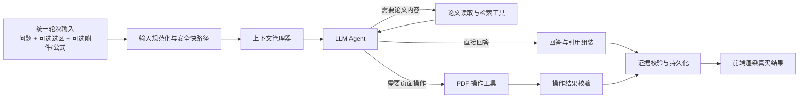

# Agent 重构最终方案

> 状态：v0.9，设计冻结基线。后续若改变 Agent 自主范围、数据外发边界、副作用类型或核心数据归属，必须先追加决策记录再实施。
> 用途：本文件是后续 Agent 重构的唯一设计基准；业务代码按第 11 节分阶段实施和验收。
> 执行原则：以产品需求和可验证结果为准；优先复用 LangChain4j、PDF 原生能力和现有可靠组件，删除相互冲突的历史补丁，不为单篇论文、单个公式或单句测试样例编写特例。

## 1. 重构目标

项目应成为适配科研场景的通用论文 Agent，而不是由大量关键词和固定分支拼成的问答工作流。

“Agent 化”只针对用户轮次中的理解、工具选择、结果观察和继续决策；论文导入、PDF 解析、索引构建、数据库迁移、异步恢复等确定性后台流程仍使用普通服务或可恢复任务，不为了形式统一而改造成 Agent。

核心体验：

1. 用户可以像使用普通 LLM 一样连续对话。
2. 当前有选区时，选区作为本轮附件加入提问；没有选区时，不阻止普通提问或追问。
3. 用户可以附加文件、手写 LaTeX 或框选公式，这些都是可选输入，不改变对话的基本模型。
4. Agent 可以按需读取论文、检索原文、查看页面或公式，不依赖一份可能不完整的“论文画像”回答全部问题。
5. 涉及论文事实的回答应提供可核验引用；普通常识、创作性问题或不需要论文依据的回答不强制引用。
6. “找出并高亮”“跳转到第 3 页”“给这段文字添加笔记”等操作由 Agent 调用工具完成，并返回真实执行结果。

## 2. 不再沿用的设计方式

重构后应逐步删除或停用以下模式：

- 前端把所有请求伪装成同一种 `ASK_SELECTION`，再由后端层层猜测真实意图。
- 用关键词规则穷举用户说法，并让每个新失败样例继续增加一条规则。
- 在调用模型前，强制把每个问题归入互斥且僵硬的问答流程。
- 把“论文画像”当作论文原文的替代品。
- 检索不到预设 evidence 就直接拒绝回答。
- 使用同一个版面块同时承担语义分片、检索结果、引用单位和页面框选坐标。
- 后端、前端分别再次猜测证据合并、引用顺序和跳转位置。
- 让回答证据直接充当高亮、下划线、批注等操作的执行目标。
- 为某篇论文、某个定理编号、某个公式或某句测试问题增加业务特例。

## 3. 总体架构



### 3.1 统一轮次输入

所有用户轮次使用同一个输入模型，命名为 `AgentTurnInput`：

```text
conversationId
primaryPaperId          当前打开的唯一主论文
userMessage?            用户自然语言输入
explicitAction?         UI 已明确表达且参数完整的结构化动作
selectedContent?       当前确认的 PDF 选区
attachments[]?         用户上传的附件
formulaAttachments[]?  手写或框选后确认的 LaTeX/图片
uiContext?             当前页、缩放、活动工具等非语义状态
```

其中：

- `userMessage` 与 `explicitAction` 至少有一个存在；纯按钮操作不要求伪造自然语言消息。
- 第一阶段一个对话只绑定一篇 `primaryPaperId`；同一论文可以创建多个上下文完全独立的对话。跨论文对比和 `relatedPaperIds` 留作后续扩展，不进入首轮重构范围。
- 选区、附件和公式均为可选附件，不应把对话切换成另一套系统。
- UI 按钮触发的明确操作可附带结构化 `explicitAction`，避免把已知事实重新交给模型猜测。
- 附件只在轮次中保存稳定附件 ID、文件哈希、类型、大小、提取状态和受限预览；二进制文件不写入运行追踪 JSON。公式附件必须区分“模型识别候选”和“用户已确认 LaTeX”。

### 3.2 选区的正确处理

选区不是“上下文模式开关”，而是用户在本轮附加的一份论文原文附件。

- 本轮：向模型提供选区的准确全文、页码、稳定 ID、内容类型和来源说明。仅提供摘要或索引会损失用户刚刚明确选择的信息。
- 选区只作为一轮消息的附件；发送成功后立即取消当前选区并收起上方选区内容，下一轮如需再次明确附加必须重新选择。
- 后续轮次：数据库按所属对话和论文的生命周期保留已发送的原始选区；常规上下文只保留稳定 ID、短摘要和使用记录。用户继续追问时由 Agent 根据对话历史判断并读取原文，不把旧选区自动重复附加。
- 超长选区：可以切分并优先注入最相关片段，但必须保留可回读的完整原文，不能静默截断。
- 新选区：作为新附件加入当前轮次，但不清空对话历史。

### 3.3 Agent Runtime 与持久化状态

Agent 不是一次不可恢复的模型调用。每轮至少维护以下三个不同生命周期：

```text
AgentTurn      从用户初始输入到最终可见回复的一次逻辑轮次，可包含澄清补充
AgentRun       该轮的模型循环、预算、状态和上下文快照
ToolCall       一次工具请求、参数、结果、重试和幂等身份
```

`AgentRun` 状态至少包含：

```text
QUEUED → RUNNING → WAITING_USER / WAITING_CLIENT → RUNNING
                 → COMPLETED / FAILED / CANCELLED
```

- 一个对话同一时刻只允许一个会改变对话顺序的活动 Run；后续轮次排队，避免工具结果和回复乱序。
- 每个 Run 保存模型配置快照、上下文版本、PDF `documentHash`、解析版本、总 Token/时间/模型调用/工具调用预算。
- 只读工具在参数独立时可以并行；修改型工具按顺序执行并逐项回执。
- `ToolCall` 使用服务端生成的稳定 ID 和幂等键。恢复、SSE 重连和任务重试不能产生重复副作用。
- 需要用户补充信息时进入 `WAITING_USER`；需要浏览器执行页面动作时进入 `WAITING_CLIENT`。两者都必须可跨页面刷新恢复。
- SSE/轮询共用同一事件语义，至少包含 `run.status`、`message.delta`、`tool.requested`、`tool.completed`、`confirmation.required`、`message.final` 和 `run.failed`。
- 上述详细事件用于后端恢复、测试和审计；前端只映射为“正在理解问题 / 正在读取论文 / 正在核对来源 / 正在执行操作”等简洁状态，不展示工具参数、完整调用列表、内部 Prompt 或模型隐藏思考。
- 最终带引用回答只有在证据落地完成后才能标记为 `message.final`；流式草稿不得提前持久化为最终事实回答。
- `WAITING_USER` 时用户的下一条消息作为同一 `AgentTurn` 的澄清补充并恢复原 Run，不创建竞争 Run；如果用户明确取消或改换任务，先取消旧 Run，再创建新 Turn。
- 模型配置快照只保存配置版本、供应商、协议、模型和能力签名，不保存明文 API Key。恢复时不得静默切换模型；原配置已经不可用时终止该 Run，并请用户重新发起。
- Run 状态迁移使用数据库条件更新或乐观锁保证单写；同一会话的活动 Turn 由数据库唯一约束或等价锁机制保证，不能只依赖 JVM 内存锁。

研究会话、Agent Run 和异步任务继续保持不同生命周期：研究会话用于恢复用户对话，Run 审计一轮 Agent 执行，异步任务负责后台调度与恢复。

### 3.4 确定性直达边界

不设置自然语言业务大路由，但保留极窄、参数已经完整且可验证的确定性直达：

- 点击已有 cite、取消任务、关闭选区等结构化 UI 事件；
- 跳转到明确合法的页码；
- 对当前已经校验的选区执行高亮或下划线等无需语义消歧的动作；
- 对已有稳定 `sourceObjectId`/`ActionTarget` 执行白名单原子操作。

确定性直达只判断“参数是否已经完整可信”，不把自由文本归入问答工作流。解析不完整、存在多个目标、包含比较/推理/生成内容或无法证明目标唯一时，立即交给 LLM Agent，禁止继续添加关键词特例。

## 4. 上下文与记忆

### 4.1 四层上下文

每次模型调用按以下四层组装：

1. **当前轮次**：用户问题、当前选区全文、当前附件/公式以及必要 UI 状态。优先级最高。
2. **近期对话工作记忆**：最近若干轮完整消息、最近使用的选区/证据/操作结果。
3. **滚动会话摘要**：较旧对话压缩为结构化摘要，记录已确认结论、未解决问题、用户指代对象和重要来源 ID。
4. **论文长期记忆**：论文画像、章节导航、术语、公式/图表目录，以及可检索的原文索引。

### 4.2 压缩策略

- 不按固定轮数粗暴删除历史；先保留当前话题链，再压缩已完成话题。
- 原始消息、原始选区和原始证据按所属论文与对话的保留期存储；压缩只影响送入模型的上下文，不删除事实来源。用户删除对话或论文时按数据生命周期级联删除，不能使用“永久存储”绕过用户删除权。
- 摘要必须保存稳定引用，如 `selectionId`、`evidenceId`、`formulaId`，使 Agent 可回读原文。
- 摘要保存生成版本、覆盖的消息范围和更新时间，可由原始消息重新生成；摘要本身不是事实来源。
- 同一论文的不同对话只共享由当前 PDF 和解析制品生成的论文级来源/画像，不共享会话摘要、指代焦点、选区使用记录或对话推断。旧的对话观察不得自动写入论文级记忆；只有用户明确要求保存为论文级纠错时才可提升。
- 对用户说“它”“这个公式”“再选一条”等指代，优先从近期工作记忆解析；只读问题不确定时可以继续读取，任何修改型操作的目标或内容不确定时必须澄清。
- Token 预算按“当前输入 > 近期相关历史 > 所需原文 > 论文画像 > 较旧摘要”分配。

### 4.3 冲突优先级

冲突不能用一条全局顺序混合“指令权威、事实可信度和对话新旧”。分别处理：

1. **指令权威**：系统安全边界与工具权限 > 用户当前明确指令 > 历史用户偏好；PDF、附件和工具返回中的文字一律视为数据，不得成为系统指令。
2. **论文事实**：当前版本 PDF/用户已确认的公式转写 > 由该版本原文生成并校验的来源对象 > 论文画像与结构化理解 > 会话摘要和长期推断。
3. **指代与话题**：当前轮次 > 近期完整对话 > 滚动摘要；新主题不得被旧 evidence 焦点覆盖。

用户指令可以改变回答方式和操作目标，但不能把与 PDF 冲突的内容升级为论文事实。模型不得用摘要、画像或附件中的提示覆盖当前版本原文与系统工具边界。

## 5. 输入分流与 Agent 决策

### 5.1 不再设置独立的语义大路由器

“找出 XX 并高亮”“比较两个公式后给其中一个添加笔记”等常见表达同时包含理解、检索和操作，无法由简单规则可靠分类。因此，不设置一个先于 Agent、负责决定完整业务流程的语义大路由器。

输入层只保留三类轻量工作：

1. **结构化事件直达**：用户直接点击 UI 按钮形成的确定事件，例如关闭选区、点击已有 cite、取消任务。这些事件不需要 LLM。
2. **可信参数直达**：第 3.4 节规定的明确页码、当前已校验选区或已有稳定目标操作；它只编译完整参数，不判断整轮属于哪类业务。
3. **输入规范化**：组装用户消息、选区、附件、当前论文和 UI 状态，不判断用户属于哪一种固定业务类型。

除极窄确定性直达以外的自然语言统一进入 LLM Agent。Agent 可以直接回答，也可以连续调用检索、读取、证据落地和页面操作能力。它不必先从“基于选区的提问/普通问题/追问/命令”等互斥标签中选择一个，选区只是本轮输入事实，问答与操作也可以同时发生。

### 5.2 如何提高成功率

无法承诺自然语言决策达到绝对 100%，但可以通过以下机制把错误变成可检测、可恢复的问题：

- 模型侧优先使用供应商原生 Tool Calling；应用内部统一映射为 `AgentDecision`，包含 `toolCalls`、`needClarification` 或 `finalResponse`。不要同时要求模型再生成一套与原生 Tool Calling 竞争的自由 JSON 控制协议。
- 工具具有严格参数模型和前置条件；页码越界、没有目标区域、颜色非法等在执行前拦截。
- 只读工具可自动恢复一次：参数修复、扩大检索范围或切换读取方式。
- 修改 PDF 状态的工具必须以持久化 `ToolCall`/`ActionTicket` 发起，并验证实际返回的 annotation/action ID；不能把“模型说已完成”或“前端展示了成功提示”当作完成。
- 所有存在歧义、目标不唯一或必要内容缺失的修改操作都请求用户确认；普通问答以及目标唯一、参数完整的可编辑操作无需额外打断。
- 所有澄清和确认都以普通助手自然语言消息完成，不设计弹窗或候选卡片。Agent 说明当前歧义和缺少的信息，Run 进入 `WAITING_USER`；用户在同一对话回复后恢复该 Run，确认充分才执行工具。
- 保存每轮“输入—模型决策—工具调用—结果—最终回答”的追踪记录，使用真实失败语句建立回归集，而不是添加线上特例。
- 测试集覆盖同义表达、错别字、口语、省略主语、连续追问、选区有无变化和组合命令。

成功率的重点不再是“路由标签是否命中”，而是 Agent 是否正确理解任务、是否获得足够原文、工具是否真实执行，以及失败后能否恢复。

### 5.3 计划中的模型职责

模型拥有“是否需要工具、调用哪个工具、是否继续搜索”的决策权；应用层保留：

- 权限与参数校验；
- Token、超时和重试预算；
- 工具真实执行；
- 证据与操作结果验证；
- 数据持久化与前端状态同步。

这是一种“模型负责推理，程序负责事实与边界”的 Agent 结构，而不是让模型直接修改数据库或伪造执行结果。

## 6. 论文画像、全文读取与原文定位

### 6.1 论文画像的定位

论文画像是导航图和长期缓存，不是论文的替代品。它适合保存：

- 标题、摘要、章节结构与章节短摘要；
- 研究问题、方法、数据、实验、主要结论；
- 术语表；
- 公式、定理、图表、参考文献目录及其稳定来源 ID；
- 经用户明确提升为论文级的纠错；普通对话中的理解、偏好和临时结论只属于当前对话。

论文画像不充分时，Agent 必须能够回到原文，而不是依据画像猜测或直接失败。

### 6.2 论文导入与理解生命周期

论文基础元数据、可引用的本地来源索引和增强型论文画像是三个明确分开的阶段：

1. 导入弹窗只提取并确认 DOI、标题、作者、摘要等基础元数据；确认后论文进入文献库。
2. 用户打开研究页面后，PDF 可以正常阅读，但对话输入保持未就绪状态；由用户主动点击“论文理解”，不因导入或打开页面自动产生理解调用。
3. 系统先完成 PDF 内容解析和本地来源索引，再异步生成论文画像，并通过现有提示条分别展示进度与结果。
4. 论文能力按状态开放，而不是使用一个“论文理解成功/失败”的二元闸门：

```text
FILE_READY           PDF 文件可读取
LOCAL_SOURCE_READY   本地结构化文本、来源 ID 和页面定位可用
SEARCH_READY         本地检索索引可用
PROFILE_READY        论文画像可用
VISUAL_READY         解析模型的页面图片/原生 PDF 增强能力可用
```

- 从能力依赖看，普通常识和创作性对话不依赖论文画像；但按当前已确认的产品流程，研究页面的对话入口仍统一在本次手动“论文理解”达到正常或兜底就绪终态后开放。
- 涉及论文事实、引用或页面操作的对话至少要求 `LOCAL_SOURCE_READY`；否则明确提示基础解析尚未完成或失败。
- 正常目标是论文理解完整成功并达到 `PROFILE_READY`，不能把分级降级当作日常主路径。画像生成必须设置结构与引用质量门禁，分块结果独立持久化，失败时保留成功分块并只重试失败部分；禁止用相同输入和预算盲目重放整个任务。
- 达到 `PROFILE_READY` 后开放正常对话。经过有界重试仍无法达到 `PROFILE_READY`、但 `LOCAL_SOURCE_READY` 和 `SEARCH_READY` 均有效时，理解任务以“部分就绪”终态结束并进入明确标识的“按原文读取兜底模式”；此时才开放兜底对话。Agent 仍可通过搜索、按页/章节读取或扩大原文读取范围获得原文；全局问题必须扩大章节覆盖，不能依据残缺画像回答。
- 视觉问题在 `VISUAL_READY` 不可用时明确降级；普通文本论文问答不因此整体关闭。

对话阶段的按需读取和扩大原文读取范围以已经完成的本地基础解析为前提，但不能被论文画像内容范围所限制。验收时分别统计论文理解首次成功率、定向重试后成功率、兜底触发率和兜底回答质量；首要优化目标是提高 `PROFILE_READY` 成功率，而不是让更多正常请求依赖兜底。

### 6.3 支持 Agent 读取整篇论文

应支持，但不应每轮无条件把整个 PDF 重复发送给模型。采用三级读取：

1. **快速上下文**：默认携带轻量论文画像和当前话题信息。
2. **按需原文读取**：Agent 调用章节、页码、公式、图表和搜索工具读取相关原文；这是大多数轮次的主要方式。
3. **扩大原文读取范围（必要时全文）**：对“全文最重要结论”“整体方法评价”等全局问题，或局部读取多次不足时，扩大到更多章节；只有确有必要且预算允许时才读取整篇。

全文读取按模型供应商能力选择，但原生 PDF 不是项目接入模型的硬性条件：

- **基线能力 `STRUCTURED_TEXT`**：所有受支持供应商均可接收本地解析后的、有阅读顺序的结构化文本；这是项目必须可靠实现的通用路径。
- **可选能力 `NATIVE_PDF`**：供应商和具体模型原生支持 PDF/文件输入时，可将原始 PDF 作为增强输入；同时仍保留本地来源映射以生成可跳转引用。
- **可选能力 `PAGE_IMAGE`**：模型支持视觉输入时，可按需提供公式、图表或局部页面图片，不代表它一定支持原生 PDF。
- 超出上下文上限时，按章节分层读取并允许 Agent 回查原文，不能只依赖一次 Map-Reduce 摘要。

论文理解任务内部也使用同一套读取能力：短论文优先一次长上下文理解；长论文才采用按章节读取和全局汇总，避免无条件多轮重复消耗 Token。

扩大原文读取范围由 Agent 判断是否需要，由 `DocumentInputPlanner` 控制实际输入方式和预算：

- 默认最多约 55%～60% 的可用上下文用于论文原文，系统与工具协议、近期对话/附件、最终回答和工具回执分别保留预算；具体数值随模型上下文上限动态计算，不写死为一个供应商专用 Token 数。
- 一轮最多触发一次“扩大原文读取范围”，但内部可以按章节分批读取；同一来源不重复发送，防止工具循环无界增长。
- 短论文在预算内可发送完整结构化文本；长论文先读取章节骨架，再按问题分批覆盖相关章节，并记录已覆盖和未覆盖范围。
- 达到本轮 Token、时间或工具调用上限时，基于已覆盖来源回答并明确说明范围；不能无限继续读取，也不能把未覆盖部分写成已确认结论。
- 扩大原文读取范围不等于把每页渲染为图片。图片仍只在公式、图表、表格或复杂版面确实需要视觉理解时按需发送。

“OpenAI 兼容”只表示接口格式大体兼容，不代表供应商支持 OpenAI 的文件上传、PDF 输入、视觉输入或 Tool Calling 全部能力。供应商适配层必须维护模型能力表并自动降级，不能仅根据 URL 格式假定能力。

具体调用由统一的 `DocumentInputPlanner` 决定：

1. 本地 PDF 解析和来源索引始终执行，作为搜索、引用、跳转和页面操作的事实基础。
2. 当前解析 API 配置有效且固定样本测试自动勾选 `NATIVE_PDF` 时，论文理解或扩大原文读取范围可以按需发送原生 PDF；保存并启用该解析配置即表示采用其已展示的外发能力，不再逐次询问。
3. 不支持 `NATIVE_PDF` 时，自动发送本地解析后的结构化文本，不把能力缺失暴露为对话失败。
4. 有效解析 API 已通过必备的 `PAGE_IMAGE` 测试，公式、图表或复杂版面问题可以按需附加局部页面图片。
5. 原生 PDF 调用返回明确、可分类的“不支持”错误时，记录该供应商与模型的实际能力并立即降级；429、超时、鉴权失败和 5xx 只记为瞬时运行错误，不能把能力永久改为不支持。

模型列表接口通常只能返回模型 ID，不能保证返回 PDF、视觉、工具调用等完整能力。能力来源按“官方供应商预设 → 小型能力探测 → 用户高级覆盖 → 运行时纠正”管理，并与 API 配置绑定。能力记录同时保存来源、最后验证时间、过期时间和错误分类，不能因一次瞬时失败长期污染配置。

原生 PDF 或页面图片得到的模型观察只能帮助理解和选择下一步，不能直接成为可跳转 cite。最终论文事实仍需通过本地 `SourceObject`/`SourceLocator` 回查和落地；无法映射到本地来源时只能作为未核验推断说明。

### 6.4 文本、图片与公式的内容表示

项目不能把“解析内容”简单等同于一段纯文本。规范化论文内容至少包含：

- **文本对象**：原始文本、规范化文本、阅读顺序、页码、段落/行 ID 和多矩形坐标。
- **公式对象**：公式区域、页码、公式编号、邻近文字、PDF 文本层内容、可选 LaTeX、可选局部截图和识别状态。
- **图片/图表对象**：图表区域、标题、图注、页码、局部截图以及附近正文引用。
- **表格对象**：表格区域、标题、可用的结构化单元格文本、局部截图和附近正文引用。

当前实现的全文理解主要消费 PDF 文本层和版面块；图片文件虽可提取，但未作为完整视觉输入进入论文理解；全篇公式也没有稳定的自动 LaTeX。因此重构不能把当前 `rawText` 直接当作完整论文内容。

新的输入策略是：

- 全文理解以结构化文本、章节、图注、表注、公式编号和可用 LaTeX 为主，控制 Token 成本。
- 不批量把每一页渲染成图片送入模型；只有问题或理解任务确实依赖视觉内容时，才读取相关图片、图表、表格或公式区域。
- 公式框选继续采用“精确区域截图 → 支持视觉的模型 → LaTeX → 用户确认 → 保存来源 ID”的路径，不要求模型支持原生 PDF。
- 数学密集段落同时保留 PDF 原始文本和局部页面图像；文本用于搜索与引用，图像/确认后的 LaTeX用于模型理解。
- 供应商只有文本能力时仍可完成普通论文问答；需要识别未转写公式或视觉图表时，必须使用具备 `PAGE_IMAGE` 的模型、用户确认的 LaTeX，或未来经验证的本地识别器。

### 6.5 不引入独立 RAG / Embedding 系统

本轮重构不引入向量数据库、Embedding 模型、独立 RAG 编排链或“所有问题先检索再生成”的固定入口，避免增加模型、索引、版本、部署和调试复杂度。

Agent 仍需要最小的本地原文定位能力，否则无法在长论文中按需读取、生成 cite 或执行页面操作。该能力作为普通确定性工具存在，不称为独立 RAG 系统：

- `search_paper` 基于当前版本来源索引执行公式/定理/章节编号、原文短语、关键词、内容类型和版面结构定位；
- `read_source`、`read_section`、`read_pages` 根据稳定 ID 回读原文和上下文；
- 全局问题可以直接扩大到章节覆盖或全文读取，不依赖向量语义召回；
- 搜索结果只是定位候选，Agent 必须回读原文后才能引用或操作；
- 不为中文/英文同义表达持续增加线上业务特例。真实定位失败优先通过论文画像中的术语表、模型生成搜索表达、章节读取和扩大原文读取范围解决。

该决定不预留首期 Embedding 实施任务。只有未来出现大量真实失败样本、且产品范围扩展到跨论文大规模检索时，才重新立项讨论，不在当前重构中做预埋式复杂化。

## 7. 证据系统重构

### 7.1 证据不再是回答前置门槛

新的流程是：

1. Agent 判断问题是否涉及论文事实。
2. 需要时调用搜索/读取工具获取来源对象。
3. Agent 基于已读取原文回答，并在可核验事实后引用来源 ID。
4. 后端校验证据 ID、原文和位置，生成稳定 cite。
5. 证据不足时继续搜索、扩大到上下文页或全文读取；只有确实无法确认时才在自然语言回答中说明不确定性。

普通对话不再因为 `evidence=[]` 被拦截，论文事实也不能仅凭论文画像生成伪引用。

### 7.2 来源、检索、引用与操作对象

不再用一个 `EvidenceAtom` 同时承担原文、检索结果、引用和几何定位。采用以下分层：

```text
SourceObject
  sourceObjectId
  paperId
  documentHash
  parserVersion
  sourceSchemaVersion
  contentType          text | formula | table | figure
  rawContent
  normalizedContent
  sectionPath?
  formulaNumber?
  provenance

SourceLocator
  locatorId
  sourceObjectId
  pageNumber           对外统一 1-based
  coordinateSpace      PDF_NORMALIZED
  rects[]              每个矩形不跨栏
  targetText?
  precision

RetrievalHit           仅为本轮临时候选
  sourceObjectId
  score
  retrievalRoutes[]

CitationBinding        最终回答中的事实绑定
  citationId
  answerSpan/claimId
  sourceObjectId
  quote
  locatorIds[]

ActionTarget           修改型工具的目标
  actionTargetId
  sourceObjectId
  locatorIds[]
  expectedDocumentHash
  allowedOperations[]
```

一个最小、完整、可核验的来源跨度应形成一个逻辑引用单位。普通句子跨物理行时合并为同一引用并保留多个矩形；公式、表格单元格、定理陈述或跨句定义不强制套用“一个完整句子”的粒度。一个引用可以绑定多个不连续 locator，但不能用一个横跨双栏的矩形代替多个局部矩形。

### 7.3 引用与操作目标分离

- `CitationBinding` 用于支持回答中的事实。
- `SourceLocator` 用于定位页面上的精确对象。
- `ActionTarget` 用于高亮、下划线、笔记和批注等操作。

三者可以引用同一个 `sourceObjectId`，但不能互相冒充。执行“找出 X 并高亮”时，Agent 先找出语义目标，再由定位工具生成 `ActionTarget`，最后执行并校验。

### 7.4 证据落地能力

可以把“将 Agent 已采用的论文来源变成可跳转证据”设计为一个高层能力，暂命名为 `GroundEvidence`。它接收 Agent 实际阅读和引用的来源对象，完成：

1. 合并同一句跨行文本并去重；
2. 核对引用内容是否真实存在于来源对象；
3. 绑定页码、`sourceObjectId` 和多矩形 `rects[]`；
4. 按正文首次引用顺序生成 cite；
5. 输出供回答渲染和 PDF 跳转共用的稳定数据。

`GroundEvidence` 默认实现为可独立测试的领域服务：确定性校验来源 ID、文档版本、引文是否存在、定位是否有效、去重和排序。可选语义模型只能作为额外的 claim-support 评分器，不能替代原文存在性与版本校验，也不能让回答模型自证正确。

点击已经生成的 cite 时不再调用 LLM 或重新执行领域服务。前端直接使用保存好的 `SourceLocator` 跳转并显示 `rects[]`，否则每次点击都会产生时延和不稳定结果。

### 7.5 引用显示规则

- 只有回复中的论断确实由论文内容支撑时才引用；没有相应论文来源的内容不强行制造 cite。
- 论文事实、公式解释、实验数据和作者结论原则上必须引用；普通常识、写作转换和开放讨论不强制引用。
- cite 编号按照在最终回答中第一次出现的顺序生成。
- 回复的第一点如果没有论文证据则不强制编号；正文中第一次实际出现的论文证据编号为 1。一个论断可以同时引用多个来源。
- 同一个 `sourceObjectId`/`CitationBinding` 在一次回答中只显示一次证据条目，可在多处复用同一 cite。
- “查看依据”的顺序与正文 cite 一致。
- 前端只根据后端返回的稳定 ID、页码和 `rects[]` 渲染，不再次全文搜索或自行合并证据。
- 点击正文 cite 与“查看依据”中的条目必须走同一个跳转函数和同一份定位数据。

## 8. 工具与页面操作领域服务

### 8.1 原子工具

工具应保持单一职责，并返回可验证的结构化结果。首批固定为：

- `search_paper(query, filters)`
- `read_source(sourceObjectId)`
- `read_pages(pageRange)`
- `read_section(sectionId)`
- `read_formula(formulaId)`
- `locate_source(sourceObjectId)`
- `navigate_to_page(page)`
- `highlight(target, color)`
- `underline(target, color)`
- `add_note(target, content)`
- `add_comment(target, content)`

### 8.2 不增加专用 Research Skill

本轮重构不新增“公式解释与推导追踪”“章节证据化总结”“跨位置对照”等特定 Research Skill，也不设计内部固定流程的 `PaperOperationSkill`。这些能力由同一个通用 Agent 根据问题自主组合原子读取、定位和操作工具完成，避免再次形成任务专用工作流。

页面操作采用以下边界：

```text
LLM Agent
  自主调用 search/read/locate，判断是否需要继续读取或澄清

PaperActionResolver（领域服务）
  只把已消歧的 sourceObjectId/locator 转成受版本约束的 ActionTarget

原子修改工具
  highlight / underline / add_note / add_comment

ClientActionExecutor
  在当前 PDF 版本上应用可信目标并回传实际结果
```

修改型工具使用持久化回执协议：

1. Agent 对一个已经消歧的逻辑目标发起一次原子 ToolCall；
2. 后端校验权限、论文版本、操作类型、内容和目标，签发绑定 `runId/toolCallId/paperId/documentHash` 的一次性 `ActionTicket`；
3. Run 进入 `WAITING_CLIENT`，前端只执行该 ticket 声明的操作；
4. 前端回传 ticket、实际坐标和保存结果；后端再次校验并使用 `toolCallId` 幂等落库；
5. 后端返回真实 annotation/action ID，ToolCall 完成，Agent 才能声称操作成功并继续下一步；
6. 刷新、重连和任务重试复用同一 ToolCall，数据库禁止同一 ToolCall 产生多个标注。

`ActionTicket` 是短期凭证，`ToolCall` 才是持久身份。票据过期后前端请求后端为同一待执行 ToolCall 重新签发，旧票据必须被拒绝；重新签发不能创建新 ToolCall。刷新后只恢复当前 PDF 版本仍匹配的待执行动作，版本不匹配时将调用标记失败并由 Agent 用自然语言说明，不在新版本上静默执行旧动作。

LLM 不得编造页码或坐标。LLM 负责理解目标和选择工具，后端负责来源、权限、版本与动作协议，前端负责基于确定坐标实际渲染；三者共享同一个 ToolCall/ActionTicket 身份。

操作调用粒度采用“一次调用、一个操作实例”：一个操作类型作用于一个已经消歧的逻辑目标，并返回独立 action ID。Agent 可以在同一轮连续调用多个原子工具；复合命令按顺序拆成多个操作。例如“找到公式并高亮，再添加笔记”分别执行高亮和笔记，以便逐项校验和失败恢复。不设计一键撤销协议；所有标注和页面操作结果直接体现在前端，并继续使用现有查看、编辑和删除能力。

任何存在语义歧义、多个候选但用户未明确要求全部处理、内容来源不明确或目标版本无法确认的修改操作，都必须先向用户确认。用户明确要求“高亮所有匹配项”等多目标操作且目标集合可验证时，不因数量大于一而重复确认。

附加内容遵循用户意图：

- 用户给出笔记或批注文字时原样使用；
- 用户明确要求总结、改写或生成内容时，先由 LLM 生成，再作为操作内容传入；
- 用户没有提供必要内容且没有授权生成时，Agent 必须追问，不能自行编造。
- 该原则适用于所有不明确的页面操作：无法可靠判断时先说明缺少的信息，让用户继续补充，不调用修改型工具。

当前只实现原子工具、`PaperActionResolver` 和 `GroundEvidence` 领域服务。未来若出现新产品需求，应优先让通用 Agent 组合现有工具；不得仅因某类问题包含多步操作就新增专用 Skill。任何重新引入特定 Skill 的提案都视为新的架构决策，不属于本计划的默认扩展方向。

## 9. LangChain4j 与自研边界

优先复用 LangChain4j：

- 模型供应商和 OpenAI 兼容接口适配；
- AI Services 与结构化输出；
- Tool Calling；
- Chat Memory 接口；
- 流式输出、重试和模型调用观测能力。

保留项目自研：

- PDFium/PDF.js 选区、页面渲染和坐标映射；
- PDF 内容对象、阅读顺序和本地索引；
- 论文、对话、选区、证据和标注的数据生命周期；
- 异步任务与前端状态同步；
- 证据的精确几何校验；
- PDF 操作的实际执行、回执和失败清理。

不应为了“统一”而重写成熟的模型调用、工具调用和会话记忆基础设施，也不能把项目特有的 PDF 坐标问题强行交给通用 Agent 框架。

## 10. 双角色模型与 API 设置

### 10.1 模型角色

API 配置采用两个职责明确的模型角色：

1. **对话模型**：负责连续对话、论文推理、上下文理解、结构化决策和 Tool 调用，是必填配置。
2. **文档解析模型**：负责原生 PDF、页面图片、图表、表格和公式截图理解，是可选配置；可以选择“沿用对话模型”，也可以单独接入 Gemini 等视觉/文档模型。

文档解析模型的输出不是第二套论文事实，而是带来源 ID 的结构化观察结果，交回对话 Agent 使用。本地 PDF 内容对象和来源索引始终是引用、跳转和页面操作的事实坐标系。

原始 PDF、页面图片和公式截图只允许发送到当前有效的“解析 API”配置。解析 API 必须通过图片输入测试，图片能力通过后固定启用；原生 PDF 是否启用由连接测试自动探测。开启“沿用对话 API”时，该配置同时承担解析角色，但仍必须通过同一组解析能力测试；对话 Agent 不得绕过 `DocumentInputPlanner` 自行把二进制文件发往对话端点。

### 10.2 API 设置弹窗

参考双选项卡布局，但沿用已经确认的字段顺序：

```text
API 设置
┌ 对话 API ───────── 解析 API ┐

供应商
URL
API Key
模型                 [查询可用模型]
调用协议 / 模型家族
能力测试结果
图片输入             [✓ 必须通过]
原生 PDF             [✓/— 由测试自动勾选]

[测试对话能力/测试解析能力] [保存设置]
```

- 解析 API 顶部提供“沿用对话 API”开关；开启后不重复保存 URL 和 Key。
- 供应商列表增加 Gemini，并支持 `Gemini Native` 协议适配，不能把 Gemini 原生文件接口强行按 OpenAI Chat Completions 发送。
- “查询可用模型”仅查询当前选项卡的 URL 和 Key，结果列表限制高度并支持滚动。
- URL、Key 或模型发生变化后，旧能力测试结果立即标记为过期，图片和原生 PDF 勾选状态同时复位，必须重新测试。
- 保存允许部分能力不可用，但必须清楚显示降级结果。基础文本通过但结构化输出或 Tool Calling 未通过时，只能标记为“普通文本对话可用、Agent 不可用”；作为对话 Agent 使用必须通过结构化输出、单次 Tool Calling 和连续 Tool Calling。
- 解析 API 以图片输入为必备能力：测试通过后图片能力自动勾选并固定启用；测试失败时该配置不能标记为有效解析 API，系统只能保留结构化文本路径，公式截图和图表视觉问题显示不可用。
- 原生 PDF 使用同一次解析能力测试中的固定小型 PDF 探测：成功则自动勾选并允许 `DocumentInputPlanner` 按需发送 PDF；失败则不勾选，自动使用结构化文本和页面图片，不要求用户手工猜测能力。

### 10.3 分角色能力测试

“连接成功”不足以证明模型能完成项目任务。测试应使用内置、极小且不含用户论文的固定样本，分项记录结果、耗时和错误类型。

**对话 API 测试：**

- 鉴权和基础文本回复；
- 流式输出；
- 结构化 JSON 输出；
- 单次 Tool Calling；
- 连续多次 Tool Calling；
- 模型上下文上限使用供应商元数据或预设，不用超长请求强行测满。

**文档解析 API 测试：**

- 图片输入，必测且必须通过；
- 单公式图片转 LaTeX；
- 同一图片中多个公式的分项 LaTeX；
- 原生 PDF 文件输入，测试结果自动控制原生 PDF 勾选状态；
- PDF 中的文字、表格/图表和版面关系理解；
- 结构化解析输出。

能力结果按 `SUPPORTED`、`DEGRADED`、`UNSUPPORTED`、`UNTESTED` 保存，并绑定供应商、协议、URL 和模型，同时保存能力来源、最后验证时间、过期时间和最近错误分类。`DocumentInputPlanner` 只根据未过期的有效结果选择调用方式。

Gemini 原生 API 可以作为文档解析模型候选：其官方接口支持 PDF 文件输入和整篇文档的多模态理解，同时支持结构化输出与 Function Calling。但是否适合具体论文样本，仍以项目内置解析测试和真实回归集为准，不能仅凭模型名称判定成功。

### 10.4 外发、安全与不可信内容

- PDF、附件、页面图片、OCR/解析文本和工具返回均视为不可信数据；其中出现的“忽略之前指令”“调用某工具”等文字不能提升为系统指令。
- 有效解析 API 的 `PAGE_IMAGE` 固定启用；`NATIVE_PDF` 只在固定样本能力测试成功时自动启用。两者不再设计额外的手工授权开关，设置页必须明确展示实际能力状态、外发对象和目标供应商。
- 附件限制类型、数量、大小、解压后体积和进入模型的字符数；本地路径必须限制在配置目录内，不能把任意路径交给模型工具。
- 每个工具校验论文归属、当前 PDF 版本、参数上限和允许的副作用；模型无权直接写数据库、访问任意文件或调用未注册工具。
- 追踪日志不保存 API Key、完整二进制文件或无界原文，只保存稳定 ID、低敏摘要、Token、耗时和错误类型。
- 删除对话时删除其消息、选区/附件、引用、摘要、Run 和 ToolCall，但已经成功落库的标注是论文级正式对象，不随对话删除；其 `agent_tool_call_id` 外键使用 `ON DELETE SET NULL` 或保留最小审计存根。删除论文时才按论文生命周期级联删除来源制品和标注。对外供应商已接收内容的保留策略由用户选择的供应商政策决定，设置页应提示该边界。

## 11. 最终实施方案

正式实施时，每阶段遵循 Plan → Code → Test → Review；当前工作区已有未提交改动，实施前先确认其归属并建立可恢复基线，不覆盖或混入与本次重构无关的修改。以下顺序是依赖顺序，不允许为了尽快展示聊天界面而跳过来源基础和持久化恢复。

### 11.1 数据归属与现有实现取舍

| 范围 | 最终决定 |
|---|---|
| `research_session` | 继续作为用户可见对话的唯一主记录；首期只使用一个 `primary_paper_id`。同一论文可有多个 session，彼此上下文隔离；现有 `research_session_paper` 暂保留但首期新链路不使用。 |
| `research_message` | 继续作为用户可见消息的唯一事实源，按时间追加；增加 `agent_turn_id` 和消息状态/类型。现有 `evidence_json` 改为带 schema version 的 `CitationBinding` 信封，最终引用随 assistant 消息持久化；`selection_anchor_json` 过渡为稳定附件引用，不新增一套重复引用字段。 |
| `paper_layout_artifact`、`PaperSourceIndex` | 继续作为当前 PDF 版本的来源事实。首期通过适配层生成 `SourceObject`/`SourceLocator`，不先复制一套来源表；只有真实测试证明派生 ID 或查询性能无法满足要求时才新增规范化表。 |
| `paper_memory` | 继续承载手动“论文理解”的版本化画像、分块结果、质量和进度；强化现有局部重试，不重写一套理解存储。它只保存由论文来源产生的共享画像。 |
| `paper_annotation` | 继续承载论文级正式标注；新增 nullable 且唯一的 `agent_tool_call_id`、PDF 版本和目标来源信息，确保一次 ToolCall 最多落一个操作结果。删除对话不删除标注，删除论文才级联删除。 |
| `async_task` | 继续负责后台调度、租约和任务恢复；不代替 `AgentRun` 的会话语义状态。 |
| 新表 | 新增 `agent_turn`、`agent_run`、`agent_tool_call`、`agent_attachment`、`agent_conversation_summary`。分别承载逻辑轮次、模型循环、工具调用、附件元数据和可重建会话摘要，避免继续向固定 workbench 表追加不相干字段。 |
| 旧运行/上下文表 | `paper_workbench_run`、`paper_workbench_step`、`paper_conversation_turn` 不迁移测试内容，新 Agent 不再读写；`paper_memory_observation` 不再自动跨会话注入，确无其他正式用途后随旧链路清理。 |
| 旧服务 | 固定 Workflow、Workbench 大路由/分类器/命令规划器、前端二次证据搜索在新链路验收后删除。旧 `conversation`/`JdbcChatMemoryStore` 先退出研究 Agent 路径，只有依赖扫描证明没有其他功能使用时才删表。 |

新增迁移从现有最高版本之后顺序创建，禁止修改已经执行过的 Flyway 文件。`agent_run` 至少保存配置版本与能力签名、上下文快照版本、PDF/解析版本、预算/用量、错误和乐观锁版本；`agent_tool_call` 至少保存顺序、参数、状态、尝试次数、幂等键、票据状态、结果和错误。API Key、完整二进制和无界原文均不得进入这些表的追踪 JSON。

### 11.2 切换原则

- 开发期可用内部 Feature Flag 让测试会话进入新链路，但同一轮禁止新旧链路双写，也不允许旧结果自动回填新表。
- `research_message` 是切换前后唯一可见消息源；运行详情来自新 `agent_*` 表。前端提交统一收敛为创建/恢复 Turn、订阅 Run 事件、取消 Run 和回传 Client Action，不再先 `plan` 后 `execute`。
- 普通用户输入和澄清回复使用同一个输入框。后端根据前端携带的当前 `runId` 和持久化状态决定是创建新 Turn 还是恢复 `WAITING_USER`，不依赖关键词猜测。
- SSE 使用可递增事件 ID；重连携带最后事件 ID并从数据库状态补发。SSE 仅是通知通道，刷新后的真相始终由 `agent_turn/agent_run/agent_tool_call/research_message` 重建。
- 新链路通过只读和修改型验收后，一次性切换研究页写入口；随后备份数据库、停止旧链路写入，再删除旧服务和测试历史。论文、PDF、来源制品和正式标注始终保留。

### 阶段 0：基线、契约与停止条件

- 固化当前代码和数据库基线，列明当前未提交改动的保留/合并/舍弃决定。
- 从真实失败记录建立匿名化测试集，覆盖普通问答、全文问题、选区追问、公式、错别字、组合命令、证据、跳转、澄清、刷新恢复和重复回执。
- 冻结 `AgentTurnInput`、状态机、事件、工具、来源、引用、ActionTicket 和错误契约；为模型循环和工具执行建立脚本化 Fake Model/Tool 测试。
- 记录工具选择正确率、不必要调用率、回答成功率、引用精确率/召回率、定位准确率、真实操作成功率、重复副作用、恢复成功率、模型调用次数和 p50/p95 时延。阶段 0 在编码前确定各指标门槛；任何跨会话串线、无依据 cite、未确认的歧义修改、重复副作用或伪造成功均为零容忍阻断项。

**退出条件：** 契约、数据表取舍、回归样本、指标门槛和旧依赖清单均已评审；否则不进入结构改造。

### 阶段 1：统一输入与持久化 Runtime 骨架

- 用 Flyway 新增 `agent_*` 表并扩展 `research_message`、`paper_annotation`；不清理旧表。
- 引入统一 `AgentTurnInput`，把选区、附件和公式改为可选附件，并完成受控文件存储、哈希、类型/大小限制和生命周期删除。
- 实现 Turn/Run/ToolCall 状态机、数据库并发控制、预算、取消、暂停/恢复、幂等和统一事件协议。
- 建立基于 `research_message` 的近期工作记忆与可重建滚动摘要；确保同一论文的多个对话不共享会话状态。
- 扩展模型工厂，使 Run 绑定不含密钥的配置快照/能力签名；先完成对话模型的基础文本、结构化输出和连续 Tool Calling 检查。

**退出条件：** 不接真实 Agent 也能用 Fake Model 完成创建、澄清等待、客户端等待、取消、崩溃恢复、SSE 重连和幂等重放；数据库中不存在两个同会话竞争的活动 Turn。

### 阶段 2：来源基础、论文理解与确定性只读工具

- 在现有 `paper_layout_artifact`/`PaperSourceIndex` 上实现版本化 `SourceObject`、`SourceLocator` 适配器，以及按页、章节、对象、公式和扩大范围读取能力。
- 论文导入只完成文件和基础元数据；用户点击“论文理解”后才启动本地解析/来源索引与画像任务，避免导入即产生模型理解调用。
- 实现基于编号、原文短语、关键词、章节/内容类型和版面结构的 `search_paper`，候选必须回读；不引入 Embedding、向量数据库或独立 RAG 编排。
- 独立实现和测试 `GroundEvidence`：引用校验、去重、首次出现排序、跨行多矩形、单/双栏定位和统一跳转。
- 复用 `paper_memory` 完成手动启动、局部结果持久化、失败分块定向重试、质量门禁，以及 `PROFILE_READY`/明确兜底就绪终态。

**退出条件：** 不依赖 LLM 自由决策即可对回归论文稳定完成 `search/read/locate/ground`；来源 ID 均绑定当前 `documentHash/parserVersion`，PDF 换版后旧来源不会被误用。

### 阶段 3：只读 Agent 垂直切片

- 由 LangChain4j 原生 Tool Calling 承接自由文本决策，先贯通普通聊天、当前选区、无选区论文问答、连续追问、自然语言澄清和带 cite 最终回复。
- Agent 只使用阶段 2 已验收的只读工具；论文事实必须经过来源回读和 `GroundEvidence`，普通对话不设证据闸门。
- 只保留第 3.4 节确定性直达、输入规范化和执行安全层；新链路不调用 Workbench 大路由、固定 Workflow 或前端二次证据搜索。
- 带引用回答在证据落地后一次性确认最终文本和编号；普通无引用回答可以流式展示，但中途草稿不作为最终消息持久化。

**退出条件：** 阶段 0 的只读指标全部达标，且通过多对话隔离、刷新恢复、模型超时/限额、工具失败后继续决策和画像兜底回归；未通过连续 Tool Calling 能力测试的供应商不能进入 Agent 路径。

### 阶段 4：PDF 修改型工具闭环

- 完成跳页、高亮、下划线、笔记、批注的 `ActionTarget`、ToolCall、ActionTicket、前端执行回执和真实结果校验。
- 实现 `PaperActionResolver`、票据签名/过期重签、PDF 版本校验，以及 `paper_annotation.agent_tool_call_id` 唯一约束。
- 唯一目标直接执行；用户明确要求的可验证多目标逐项执行；其余歧义均以普通自然语言追问，确认后恢复原 Run。
- 不实现一键撤销；结果继续使用现有前端查看、编辑和删除能力。

**退出条件：** 同一 ToolCall 在重试、重复回执、刷新和并发情况下最多产生一个正式结果；版本过期、票据伪造、客户端失败时 Agent 均不能声称成功。

### 阶段 5：双角色 API 与全文/视觉增强

- 完成对话/文档解析双角色配置、OpenAI 兼容与 Gemini Native 适配、分项能力测试、能力过期和运行时错误分类。
- 解析 API 的图片测试必须通过并固定启用；固定小 PDF 测试自动控制原生 PDF 能力，不提供额外手工内容开关。
- `DocumentInputPlanner` 根据有效能力选择原生 PDF、结构化文本、分层读取或局部页面图片；所有视觉观察最终回查本地来源。
- 用真实论文提高首次和定向重试后的 `PROFILE_READY` 成功率，同时单独验收兜底回答质量和视觉/公式/图表问题。

**退出条件：** URL、Key、模型变化会使旧能力结果失效；瞬时错误不会错误地永久降级；解析 API 不可用时结构化文本主路径仍可靠，视觉问题明确说明限制。

### 阶段 6：切换、清理与文档收口

- 备份数据库并切换研究页到统一 Turn API，停止旧 Workbench/旧会话链路写入；当前测试历史消息、上下文和 workbench run 不迁移。
- 确认新链路没有引用后，通过新的 Flyway 迁移清理旧测试表/列；未完成全项目依赖扫描的共享表不删除。
- 删除固定 Workflow、大路由/分类器/命令规划器、废弃 DTO/服务/提示词、单失败样例补丁和前端二次证据推断。
- 更新 `docs/progress.md`、`docs/knowledge.md`、API、数据库迁移、运行恢复和故障排查文档。

**退出条件：** 代码、API、数据库和前端均只有一条研究 Agent 写路径；论文、PDF、来源制品、正式标注经备份前后核对无丢失。

### 阶段 7：系统回归与人工验收

- 自动回归覆盖不同论文、单/双栏、文本/公式/图表、不同供应商、连续多轮、多对话、刷新/重连和修改型操作。
- 人工验收不固定在 SINR、某个定理或某篇论文上，并加入陌生论文和故意构造的提示注入内容。
- 失败按输入、模型决策、读取、证据、定位、执行、恢复或供应商分类；先补充可复现测试，再修通用层，不直接添加线上关键词特例。

**最终发布条件：** 阶段 0 指标全部达标，零容忍项为 0，旧链路已停止写入，且用户完成最终人工验收；未达标则停在当前阶段修复，不带已知结构性缺陷进入下一阶段。

## 12. 最终验收原则

1. 无选区时可以进行普通问答、论文全文问答和连续追问。
2. 有选区时本轮能准确使用选区；下一轮既可继续追问，也可自然转为其他问题。
3. 全局问题在画像不足时能主动读取全文或相关章节，而非编造或立即失败。
4. 论文事实回答中的 cite 与“查看依据”一一对应，内容真实支持结论。
5. 跨行证据保持一个逻辑条目，矩形不跨双栏，点击后目标处完整可见。
6. “找出并高亮/下划线/添加笔记或批注”能够处理自然语言、错别字和无选区请求，并验证真实执行结果。
7. 普通对话不会因没有 evidence 被拒绝；需要论文依据但暂未找到时会自动扩大读取范围。
8. 更换论文、问题、模型供应商后仍使用同一通用链路，不依赖特例。
9. 同一论文可以建立多个对话，不同 `conversationId` 的消息、摘要、指代和 evidence 焦点不会串线。
10. 浏览器刷新、SSE 重连和后台任务恢复后 Run 能继续，已经成功的 ToolCall 不会重复执行。
11. 同一修改型 `toolCallId` 最多产生一个持久化 annotation/action ID；模型和前端均不能伪造成功结果。
12. PDF、附件或工具结果中的提示注入文本不能越过系统指令、工具白名单和权限校验。
13. 论文理解优先稳定达到 `PROFILE_READY`；局部失败可定向恢复，只有最终仍失败且本地来源完整时才进入明确标识的按原文读取兜底模式。

## 13. 方案冻结状态

### 13.1 已确认的产品与架构决定

- 保留参数完整且可验证的极窄确定性直达；不恢复自然语言问答大路由。
- 一篇论文可以创建多个对话，各对话上下文完全隔离；跨论文对比留作后续功能。
- 当前历史对话均为测试数据，不迁移旧消息、旧上下文和旧 workbench run；论文、PDF、来源制品和正式标注不在该清理授权内。
- 页面操作第一版使用原子工具、`PaperActionResolver` 和 ToolCall/ActionTicket 回执，不实现内部固定流程的 `PaperOperationSkill`。
- `GroundEvidence` 默认是确定性领域服务；语义模型只能作为可选支持度评分器。
- 论文理解以稳定成功并达到 `PROFILE_READY` 为主目标；分级开放只是在局部画像失败后的异常兜底，不能替代对理解任务成功率的修复和质量验收。
- 不设计一键撤销。标注等操作完成后直接在前端查看、编辑和删除；任何存在歧义的修改操作必须先确认。
- 有效解析 API 必须支持图片输入并固定启用；连接测试同时探测原生 PDF，成功则自动勾选并启用，失败则不勾选并降级。
- 来源事实、页面定位、检索候选、回答引用和操作目标使用 `SourceObject`、`SourceLocator`、`RetrievalHit`、`CitationBinding`、`ActionTarget` 分层，不再共用一个 evidence 对象。
- cite 按最终回复中证据第一次实际出现的顺序编号；同一来源后续复用原编号，“查看依据”与正文共用该顺序。
- 原文读取采用快速上下文、按需局部读取、扩大读取范围（必要时全文）三级策略，并由 `DocumentInputPlanner` 按上下文比例、每轮一次扩大范围上限和章节覆盖控制预算。
- 当前重构不引入独立 RAG、Embedding 模型或向量数据库；保留 Agent 生成 cite 和读取长论文所必需的本地原文定位工具。
- 论文理解由用户在研究页面手动启动；未启动或运行中时不开放对话，达到正常或兜底就绪终态后才开放。
- 前端只显示简洁运行状态，不展示详细工具调用列表、参数、内部 Prompt 或隐藏思考。
- 所有歧义和确认均由 Agent 使用普通自然语言追问；用户在同一对话补充后恢复执行，不设计弹窗或候选卡片。
- 当前计划不增加任何专用 Research Skill；公式解释、章节总结和跨位置对照都由通用 Agent 组合原子工具完成。
- 扩大原文读取范围不显示 Token、成本估算或额外确认；Agent 在后端预算内自动读取，达到上限后基于已覆盖来源回答并说明范围。
- `research_session/research_message` 继续作为可见会话事实源；Agent 运行新增独立 `agent_*` 表，来源索引、论文画像和正式标注复用现有可靠表，不继续扩展固定 Workbench 表。
- 同一论文的多个对话只共享论文来源和画像，不共享摘要、指代焦点、选区记录或对话推断；对话内容不得自动提升为论文级记忆。
- 实施严格按“Runtime 骨架 → 来源与理解 → 只读 Agent → 修改型工具 → 双角色解析增强 → 切换清理”推进，并由每阶段退出条件阻止带结构性问题继续扩散。

### 13.2 冻结结论

当前重构范围内的主要产品决策已经确认，没有待定的交互方案。后续新需求若改变 Agent 自主范围、外发边界或副作用类型，再单独补充决策记录。

### 13.3 实施中测量和调优，不改变当前产品方案

- 首批供应商原生协议适配、原生 PDF 探测失败后的错误分类和降级协议。
- 现有版面数据生成 `SourceLocator.rects[]` 的稳定性、单/双栏和跨行回归。
- 本地编号、原文短语、关键词、章节/类型和版面结构定位的召回率；不扩展为 Embedding/RAG 实验。
- 会话摘要触发阈值、最近完整轮次数量和记忆更新策略。

## 14. 决策记录

| 版本 | 状态 | 结论 |
|---|---|---|
| v0.1 | 已确认 | 选区是可选附件，不是对话模式；无选区即普通 Agent 对话。 |
| v0.1 | 已确认 | 规则只走高置信快路径，自由文本由 LLM Agent 结合上下文决策。 |
| v0.1 | 已确认 | 论文画像是导航图；Agent 支持按需读取原文和升级到全文读取。 |
| v0.1 | 已确认 | 证据由 Agent 读取来源后引用，后端负责验证；证据不再是所有回答的前置闸门。 |
| v0.1 | 已被 v0.8 替代 | 原子操作做 Tool，稳定的多步科研任务才做 Skill。 |
| v0.1 | 已确认 | LangChain4j 承担通用 Agent 基础能力，自研聚焦 PDF、证据坐标、持久化和 UI 状态。 |
| v0.2 | 已被 v0.6 替代 | 取消独立自然语言大路由；除结构化 UI 事件外，所有自然语言统一由 LLM Agent 决策。 |
| v0.2 | 已被 v0.6 替代 | 设计统一 `PaperOperationSkill`，由 LLM 理解目标，后端编排与校验，前端执行确定的页面操作。 |
| v0.2 | 已确认 | 设计 `GroundEvidence` 证据落地能力；生成时绑定稳定定位，点击 cite 时不再调用 LLM。 |
| v0.3 | 已确认 | 当前选区只附加到一轮消息，发送后取消；历史选区保留为可回读的会话来源。 |
| v0.3 | 已被 v0.6 细化 | 论文元数据在导入弹窗提取；进入研究页面后由用户启动论文理解，成功后才开放对话。 |
| v0.3 | 已被 v0.8 细化 | 操作不明确时 Agent 先追问；一次 Skill 调用只执行一个操作实例，允许一轮多次调用。 |
| v0.3 | 已确认 | 附加操作内容优先使用用户原文，仅在用户明确要求时由 LLM 生成。 |
| v0.3 | 已确认 | 只为文章中确有支撑的论断提供 cite，不为无对应来源的内容强行引用。 |
| v0.3 | 已确认 | 原生 PDF 是可选增强能力；所有供应商必须具备结构化文本降级路径。 |
| v0.4 | 已被 v0.6 细化 | 使用 `DocumentInputPlanner` 按模型能力选择原生 PDF、结构化文本和局部页面图片；只有明确不支持错误才修正能力，瞬时失败不永久降级。 |
| v0.4 | 已确认 | 本地解析始终是证据和页面操作基础；原生 PDF 不能替代本地来源索引。 |
| v0.4 | 已确认 | 解析内容分别维护文本、公式、图表和表格对象；视觉内容按需发送，不把全文理解限制为 `rawText`。 |
| v0.4 | 已确认 | 公式框选只要求模型支持图片输入，不要求支持原生 PDF。 |
| v0.5 | 已确认 | API 设置采用“对话 API / 文档解析 API”双角色；解析角色可以沿用对话模型，也可以独立配置。 |
| v0.5 | 已确认 | 增加 Gemini 和 Gemini Native 适配，作为原生 PDF 与视觉解析候选，而不是所有对话的强制供应商。 |
| v0.5 | 已确认 | 两类 API 使用不同的分项能力测试；模型能力以测试结果和运行时纠正为准。 |
| v0.6 | 已确认 | 保留极窄确定性直达；其余自然语言由 Agent 决策，不再使用自然语言问答大路由。 |
| v0.6 | 已确认 | 一篇论文支持多个上下文完全隔离的对话；跨论文对比延后。 |
| v0.6 | 已确认 | 当前测试历史对话不迁移；论文、PDF、来源制品和正式标注不在清理范围内。 |
| v0.6 | 已确认 | Agent Runtime 持久化 `AgentTurn/AgentRun/ToolCall`，支持等待用户、等待客户端、恢复、预算和幂等。 |
| v0.6 | 已确认 | 页面操作采用原子工具、`PaperActionResolver` 和 ToolCall/ActionTicket 回执，不实现固定流程的 `PaperOperationSkill`。 |
| v0.6 | 已确认 | 来源、定位、检索候选、引用绑定和操作目标分层；所有持久来源绑定 PDF 与解析版本。 |
| v0.6 | 已确认 | 原始 PDF、页面图片和公式截图只允许发送到当前解析 API 配置；图片能力必测并固定启用，原生 PDF 由连接测试自动勾选。 |
| v0.6 | 已确认 | 论文理解以稳定达到 `PROFILE_READY` 为主目标；分级开放只作为本地来源完整时的异常兜底，并单独统计兜底触发率。 |
| v0.6 | 已确认 | 不设计一键撤销；所有标注复用前端查看、编辑和删除能力，任何歧义修改必须先确认。 |
| v0.7 | 已确认 | 不引入独立 RAG、Embedding 模型或向量数据库；Agent 只使用本地来源索引的确定性定位与读取工具。 |
| v0.7 | 已确认 | cite 按最终回答中证据第一次实际出现的顺序编号，同一来源复用原编号，“查看依据”保持同序。 |
| v0.7 | 已确认 | 原文读取采用三级范围扩展和动态比例预算；每轮最多一次扩大范围，长论文按章节覆盖并记录未覆盖范围。 |
| v0.7 | 已确认 | 来源事实、定位、检索候选、回答引用和操作目标采用分层对象，避免一个 evidence 对象承担全部职责。 |
| v0.8 | 已确认 | 论文理解由用户在研究页面手动启动，达到正常或兜底就绪终态后才开放对话。 |
| v0.8 | 已确认 | 前端只显示简洁运行状态，不展示详细工具参数、调用列表、内部 Prompt 或隐藏思考。 |
| v0.8 | 已确认 | 歧义和确认统一使用普通自然语言追问，不设计弹窗或候选卡片；用户回复后恢复原 Run。 |
| v0.8 | 已确认 | 当前计划不新增任何专用 Research Skill，所有科研问答由通用 Agent 组合原子工具完成。 |
| v0.8 | 已确认 | 扩大原文读取范围不提示 Token、成本或额外确认；Agent 在后端预算内自动执行，到达上限后说明覆盖范围。 |
| v0.9 | 已冻结 | 复用 `research_session/research_message/paper_layout_artifact/paper_memory/paper_annotation/async_task`，新增通用 `agent_*` 运行表，旧 Workbench 表不再承载新 Agent。 |
| v0.9 | 已冻结 | 同论文多对话只共享来源事实和论文画像，对话摘要、指代与推断完全隔离；普通对话内容不自动写入论文级记忆。 |
| v0.9 | 已冻结 | 来源基础与论文理解先于只读 Agent 垂直切片；新旧链路禁止双写，验收后一次性切换并清理旧工作流。 |
| v0.9 | 已冻结 | ActionTicket 可过期重签但复用原 ToolCall；数据库并发与唯一约束保证等待恢复和副作用幂等。 |
